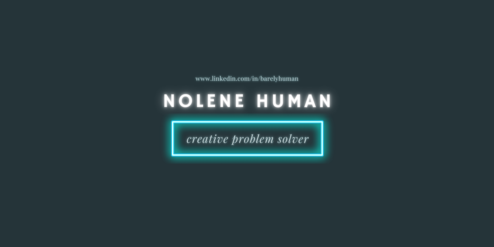

## Welcome to my Capstone Project Documentation

I used my Bachelor of Software Engineering final paper to build on my cybersecurity skills and knowledge set out in CyBOK (Cybersecurity Body of Knowledge)  Networking, Cryptography and Software Security. By leveraging the CyBOK knowledgebase, I ensure my approach is rooted in the most up-to-date industry knowledge requirements. 

The knowledge not only equips me to address a wide range of cyber threats, but also add experience in the basic skills required.

The Open Web Application Security Project (OWASP) principles are an essential component of this project, focusing specifically on the security of web applications. I followed the web security testing guide principles, addressing the most critical web application security risks and mitigate vulnerabilities effectively using various tools. 

By integrating OWASP principles with CyBOK, I want to build my knowledge and habit in proactively design, build and develop my environments and applications against common vulnerabilities.

I have captured my learnings and journey on each topic. 

<h3 style="color:rgb(167, 22, 102)">The Topics</h3>

* Network Security
* Application Security
* Database
* Cryptography

🔐 == Security Feature implemented
💢 == Hurdles
💪 == Learnings
🚀 == Favourite

# Network
*The network is down due to suspicious activities that caused concerns.
Here is where the project got to:

## Step 1: Install Linux Ubuntu
- Dual Boot Windows machine with Linux Ubuntu
## Step 2: Install Webserver
- This projec is using [NGINX](https://www.nginx.com/) over Apache because it is more resouce-effecient with higher performance and more secure. However Nginx cannot process dynamic content like Apache. Because the application hosted on this server is written using Flask Gunicorn had to be included into the stack.
  
 | Tool    | Description                          |
| :---------- | :----------------------------------- |
| Flask       | Web Application Framework   |
| SQLite3      | Database  |
| Gunicorn       | [Web Server Gateway Interface](https://www.youtube.com/watch?v=BpcK5jON6Cg&t=870s) |
| Nginx    | Proxy Server |

## Step 3: Port Forwarding
| Solution   | Category                          |
| :---------- | :----------------------------------- |
| Cloudflare    | 🔐 DNS |
| Cloudflare    | [Tunnel](https://www.youtube.com/watch?v=hrwoKO7LMzk&t=462s)|

## Future Improvements: Improve Security
### [STRIDE](https://learn.microsoft.com/en-us/azure/security/develop/threat-modeling-tool-threats)
Spoofing 
Tampering  
Repudiation  
Information disclosure (privacy breach or data leak)  
Denial of service  
Elevation of privilege  

__________________________________________________________________

# Fang Services

<h3 style="color:rgb(167, 22, 102)">Goal</h3>

This section outlines the applied ‘test early and test often’ methodology to enhance the security of the application and mitigate the risk of attacks. Following the 4 out of 7 the Software Development Life Cycle (SDLC) model proposed by the Open Web Application Security Project (OWASP) , which consists of seven phases: definition, design, development, testing, deployment, maintenance, and retirement. In each phase, this project performed various security activities, such as threat modeling, automated testing (using Snyk), code review, and pentesting techniques, to identify and address any vulnerabilities or weaknesses in the application. 

## Application Vulnerability Score

| PHASE  | Vulnerability Score                          |
| :---------- | :----------------------------------- |
|Before Development Begins|
CRITICAL
|
|During Design|
CRITICAL
|
|Before Launch|HIGH|
|During Deployment|MEDIUM|

MVP: 

* Verification (seperate application) 
* Login 
* Network Scanning Tool 

This application is built using:

* Python,  
* Flask, and  
* SQLite3

# How to Run the Project
python fang.py
